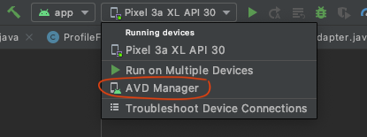
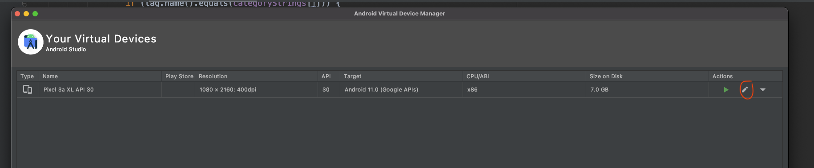
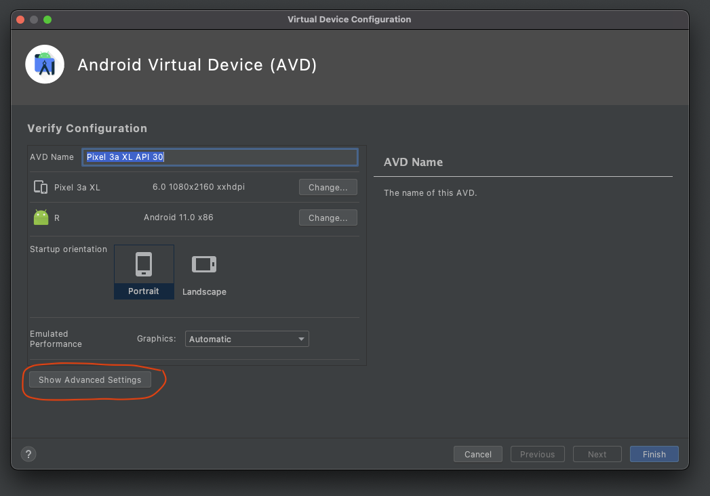
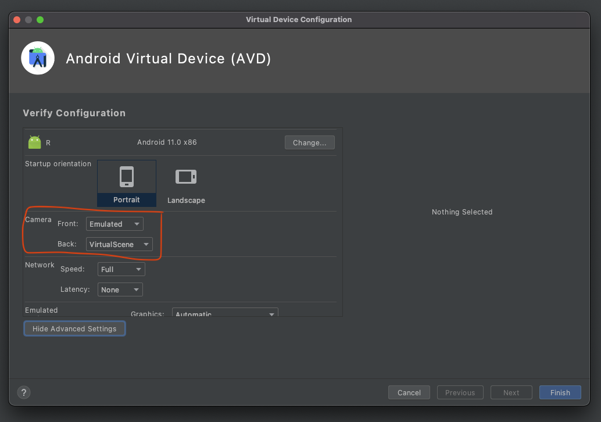
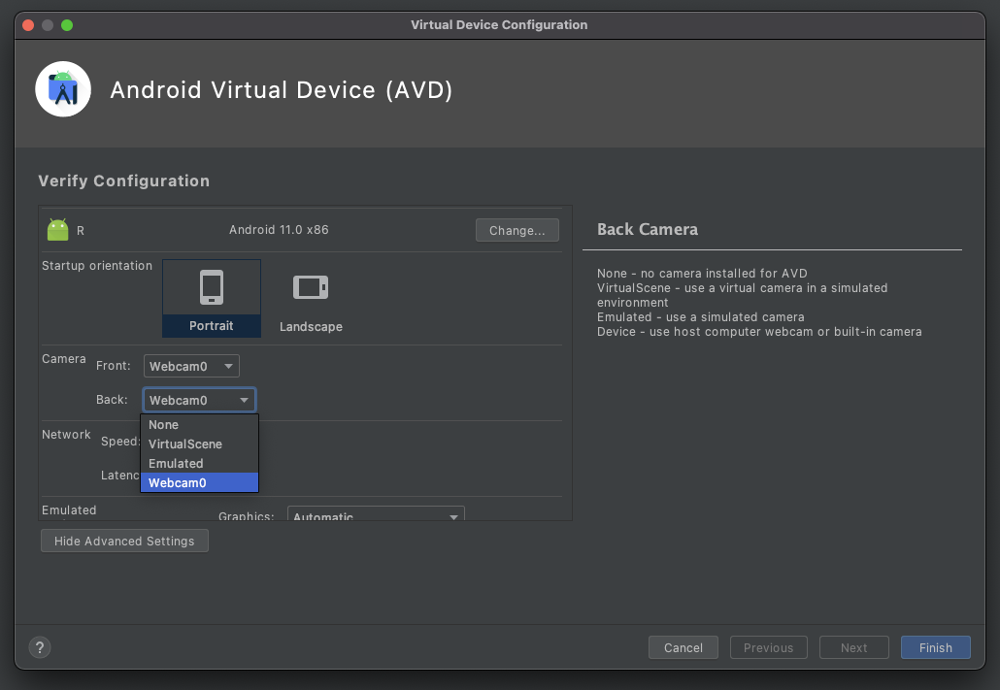

# Matbjörg app
Þetta er framendi ofaná Matbjörg bakenda sem er að finna hér [bakenda repo](https://github.com/asmundur31/Matbjorg).

## Uppsetning
Í skránni NetworkController er hægt að skipta á milli local og remote bakenda.

Til þess að keyra upp appið í emulator með remote bakenda þá þarf að gera eftirfarandi:
1. Clone-a þetta repo á tölvuna þína.
2. Keyra appið í Android Studio með emulator.

Til þess að keyra upp appið í emulator með local bakenda þá þarf að gera eftirfarandi:
1. Clone-a þetta repo á tölvuna þína.
2. Clona-a repo sem inniheldur bakenda á tölvuna þína ([Bakenda Repo](https://github.com/asmundur31/Matbjorg)).
3. Setja upp postgres gagnagrunn og passa að application.properties skráin hafi réttar upplýsingar í bakenda.
```
spring.datasource.url=jdbc:postgresql://localhost:5432/<nafn á gagnagrunni>
spring.datasource.username=<notandanafn>
spring.datasource.password=<lykilorð>
```
4. Keyra upp bakenda með IntelliJ
5. Keyra appið í Android Studio með emulator.

Athugið að á remote bakenda eru dummy gögn og dæmi um notendur eru:

Kaupandi: 
- Ásmundur Óskar Ásmundsson
- Notandanafn: asmundur31@gmail.com
- Lykilorð: 123

Söluaðili: 
- Krónan
- Notandanafn: kronan@kronan.is
- Lykilorð: 123

## Myndavél

Þegar ný auglýsingin er búin til þá þarf að bæta við mynd af vöru sem á að auglýsa. Við það opnast fyrir myndavélina á síma viðkomandi. 

Ef notaður er emulator með Android Studio þá þarf að gera myndavélina virka með því að fylgja eftirfarandi skrefum:






## Virkni sem var komin fyrir code review
Karfa
1. Birta körfu
2. Breyta magni af items
3. Eyða items
4. Kaupa körfu

Auglýsingar
1. Birta allar auglýsingar (vörur)
2. Skoða betur eina auglýsingu (vöru)
3. Það virkar ekki að bæta aulýsingu við í körfuna

Setja inn auglýsingu
1. Setja inn nýja auglýsingu frá heimasvæði seljanda
2. Vantar að setja inn mynd (kemur alltaf default mynd)
3. Athugið að vöruflokkar sem hakað er í fylgja ekki með

Innskráning
1. Hægt að skrá sig inn

Útskráning
1. Hægt að skrá sig út

Nýskráning
1. Hægt að stofna nýjan aðgang sem kaupandi
2. Hægt að stofna nýjan aðgang sem söluaðili

Heimasvæði
1. Kaupandi getur séð pantanir sem hann hefur gert (active og inactive orders)

